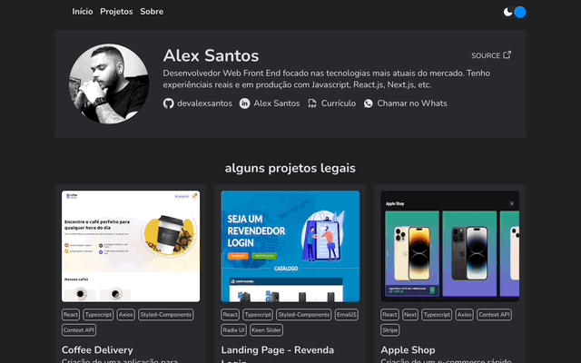

<h1 align="center">Site Pessoal - Alex Santos</h1>

Site pessoal desenvolvido para mostrar de forma mais amigável um pouco dos meus projetos e sobre mim. Utilizei o Hygraph como CMS, consumindo uma API GraphQL.

  <h3> 🚀 Publicado 🚀 </h3>
  <strong><a href="devalexsantos.com" target="_blank">🔗 devalexsantos.com</a></strong>

# Sumário
-[Funcionalidades](#funcionalidades)  
-[Imagens](#imagens) 
-[Tecnologias](#tecnologias) 

# Funcionalidades
- [x] Informações Pessoais e Projetos
- [x] Dark/Light Mode Theme
- [x] Utilização do Hygrapg CMS para input dos dados
- [x] Consumo de API GraphQL
- [x] Responsivo

# Imagens

# Tecnologias
As ferramentas utilizadas foram:
<ul style="list-style: none">
  <li>React com o Next.js</li>
  <li>Typescript</li>
  <li>GraphQL Request</li>
  <li>Radix UI</li>
  <li>Phosphor Icons</li>
  <li>Styled Components</li>
</ul>

  <h3> 🚀 Publicado 🚀 </h3>
  <strong><a href="devalexsantos.com" target="_blank">🔗 devalexsantos.com</a></strong>

# Autor

<a href="https://github.com/devalexsantos">Alex Santos</a>

